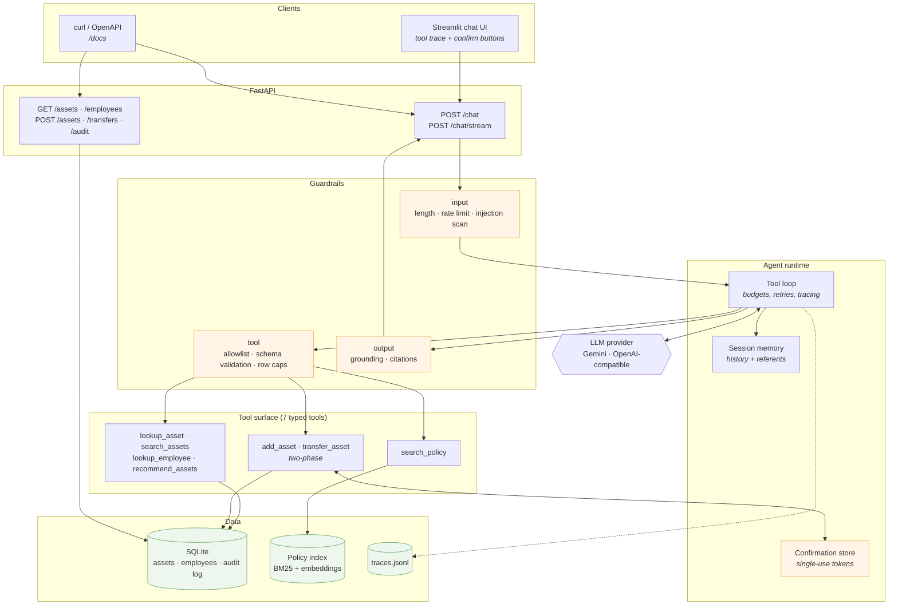
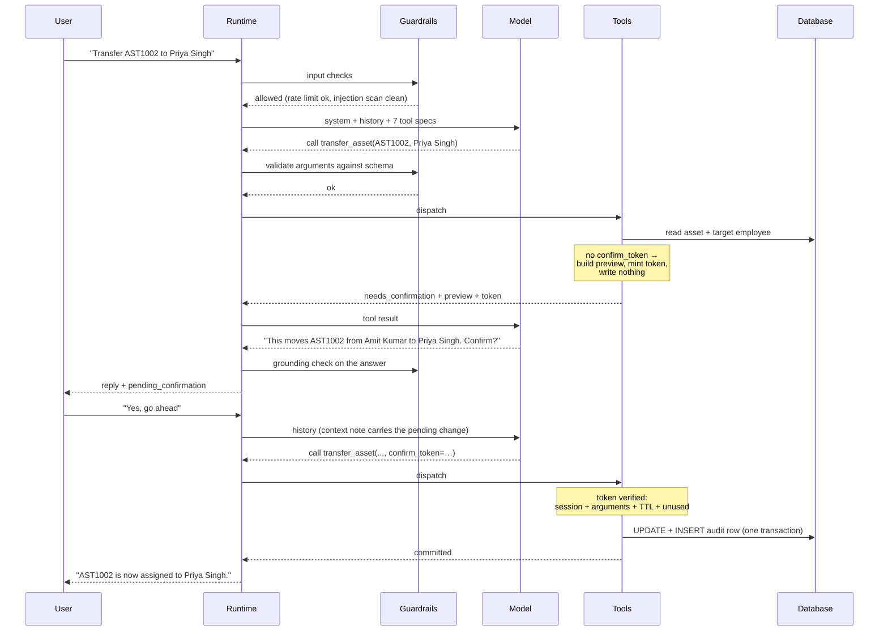
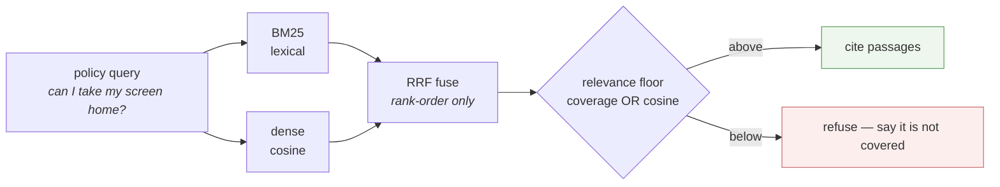
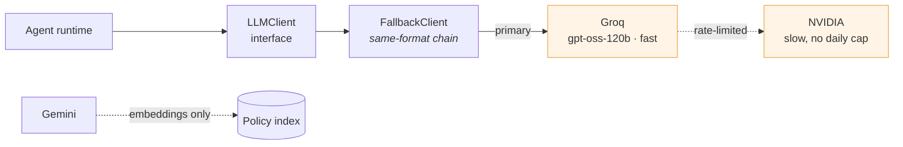

# Architecture

## System overview



## One turn, end to end



## Guardrail layers

| Layer | Control | Failure it prevents |
|---|---|---|
| Input | Length cap, per-session rate limit, control-character stripping | Prompt-stuffing; one client exhausting the shared free tier |
| Input | Injection pattern scan → flagged, turn continues with a reminder | Silent compliance with "ignore your instructions" |
| Retrieval | Passages fenced as untrusted data; system prompt says data never instructs | A policy document that tells the agent to transfer assets |
| Tool | Allowlist dispatch — unknown name returns an error result | Hallucinated tool name crashing the turn |
| Tool | Pydantic validation before the handler runs | Malformed or unbounded arguments reaching SQL |
| Tool | Enums generated from live data | Filters on categories or cities that do not exist |
| Tool | Parameterised SQL only, no text-to-SQL tool | SQL injection; unbounded table reads |
| Loop | 8 tool calls, 6 iterations, 90 s wall clock | A model looping until timeout |
| Loop | Final pass runs with tools removed | A turn ending mid-plan with no answer |
| Write | Two-phase confirmation token | Any mutation the user did not approve |
| Write | Token inert until a later user turn releases it | The model previewing and redeeming its own token in one turn |
| Write | Release requires an affirmative answer; anything else discards the preview | A refusal, or an ignored preview, being redeemed on a later turn |
| Write | Token bound to session + arguments + TTL, single use | Replay; approval swapped onto a different change |
| Write | Optimistic concurrency on `updated_at` | Committing against a row that moved after the preview |
| Write | Idempotency key + audit row per mutation | Double-applied retries; unattributable changes |
| Output | Asset codes cross-checked against tool results | Confidently inventing an asset that does not exist |
| Output | Citation required when policy was retrieved | Unsourced policy claims |

The write gate is the load-bearing one. Everything else reduces the chance of a
mistake; the token gate makes an unapproved write *structurally* impossible,
regardless of how convinced the model is.

Note the two release rows carefully, because together they are what make the
claim true.

Binding a token to session, arguments and TTL says nothing about *who* redeemed
it, and the token is handed to the model in the tool result — so a model that
previews a change can immediately redeem its own token and report the change as
done, without the user having seen a thing. Tokens are therefore inert until
`ConfirmationStore.release_for_session` marks them redeemable, which happens
once per user turn at the top of `run_turn`. Commit requires a second user
message.

A second user message is necessary but **not sufficient**, and conflating the
two was a real defect. Releasing on any next message meant the user's answer
was never read: "no, cancel that" released the write it refused, and the UI's
Cancel button — which sends exactly that text — armed the change it existed to
stop. The only remaining obstacle was the model declining to use a token it held
and was entitled to redeem.

So `run_turn` resolves an outstanding preview against the answer itself, via
`interpret_confirmation`, and the default is deny:

| User's next message | Effect on the pending preview |
|---|---|
| Clear affirmative — "yes", "go ahead", "confirm" | Released; redeemable this turn |
| Clear refusal — "no", "cancel", "stop" | **Discarded** |
| Anything else — a question, a new instruction, silence on the subject | **Discarded** |

Discarding rather than merely withholding approval is the important half: an
unapproved token still sits in the store, and the *next* turn would otherwise be
a fresh chance to release it. A preview the user declined stops existing.

The parse is deterministic, narrow and applied to the user's words in code — the
model never sees the decision and cannot argue with it. An unusually phrased
approval therefore reads as "no decision" and the write must be asked for again.
That is the safe direction to fail in.

This is also a lesson about tests. The eval case asserting the database was
unchanged after a cancellation passed throughout, because the model happened to
behave. A green assertion that measures manners rather than mechanism is worse
than no assertion, since it buys confidence it has not earned. The case now
asserts the guardrail fired, not just that nothing moved.

## Retrieval — hybrid, with a floor

The 21-row asset table is not a retrieval problem: "how many printers in Mumbai"
needs an exact count, so it runs as SQL. The policy corpus *is* prose, so it
runs as hybrid RAG. The model picks per question. The engineering that matters
is the floor — knowing when to return nothing.



Reciprocal Rank Fusion consumes ordering, not scores, so there is nothing to
tune between BM25's unbounded numbers and cosine's [-1, 1]. Measured on the
corpus: **7/7 in-scope recall, 5/6 correct refusals**; the one leak passes the
lexical floor and is documented in `tests/test_rag.py`.

## Provider layer — swappable, with fallback

The runtime talks to an `LLMClient` interface, never a vendor SDK, so switching
provider is one line in `.env`. Providers that share the OpenAI wire format have
interchangeable tool-call history, so they chain: when one free tier is
exhausted, the turn transparently drops to the next instead of failing.



Gemini's tool-call format differs, so it is kept out of the chat chain and used
only for the embedding half of retrieval — a separate quota that chat traffic
cannot exhaust. A whole-chain exhaustion still surfaces as a rate-limit, not a
generic error, because the runtime keys its "try again" message off that type.

## Design decisions

**Hand-written tool loop, not an SDK auto-loop.** The confirmation gate has to
suspend a turn between two HTTP requests — preview returns to the user, the turn
ends, the commit happens later with conversation intact. An automatic loop that
runs tools to completion inside one call cannot express that. Owning the loop
also puts guardrail checks between the model deciding to act and the action
happening.

**No text-to-SQL tool.** A fixed surface of seven typed tools costs some
expressiveness and buys three things: injection stops being a live concern, tool
selection becomes measurable in evals, and every query has a bounded cost.

**Compound `lookup_asset` return.** It returns the holder *and* the holder's
manager, so the brief's multi-step question resolves in one call. Free-tier
models chain unreliably; removing an unnecessary hop is cheaper than prompting
around it.

**Ranking in code, not in the prompt.** Availability is a fact, not a judgement.
`recommend_assets` filters to `status='Available'` in SQL, so the model cannot
offer an in-repair machine however the question is phrased.

**Referents recorded from tool results, not parsed from user text.** "Who is
using it?" resolves because the runtime remembers what was actually looked up
and passes that as session context. A pronoun regex would break on the first
phrasing nobody anticipated.

**Provider behind an interface.** The runtime imports no vendor SDK. Gemini is
primary; any OpenAI-compatible endpoint is a config change. Written for a free
tier that can run out mid-demo.

**Validation in our layer, not the provider's.** Gemini honours only a subset of
OpenAPI schema and ignores `additionalProperties: false`, so arguments are
validated with Pydantic before dispatch. Stronger than trusting the provider and
portable across providers by construction.

## Repository layout

```
src/assistant/
  config.py            all tunables in one settings object
  llm/                 provider abstraction — base, openai_compat, gemini,
                       nvidia_nim, cerebras, ollama, fallback
  db/                  schema.sql, seed.py, repo.py (only module importing sqlite3)
  tools/               7 tools, schemas, registry, catalog
  rag/                 chunker, index, hybrid retriever
  agent/               runtime (the loop), prompts, memory, confirm
  guardrails/          input, injection, limits, output
  api/                 FastAPI app + models
  ui/                  Streamlit chat client
  obs/                 structured tracing
evals/                 cases.yaml, runner.py, report.md
tests/                 151 tests, no network required
docs/policies/         7 policy documents (the RAG corpus)
```

## Built today vs. production hardening

This is a single-agent system with a real safety model — not a multi-agent
platform. Naming the gap is the point: everything on the right is a deliberate
next step, not an oversight.

| Built & verified | Production would add |
|---|---|
| Single agent, real tool selection (7 typed tools, no phrase→tool map) | Identity & multi-tenant — OIDC, per-request `tenant_id`, no shared trust |
| Two-phase write gate — turn-gated **and** consent-gated tokens | Policy Enforcement Point — row-level filter on *every* query |
| Hybrid RAG — BM25 + dense, RRF, relevance floor with refusal | Durable state — sessions & tokens in Redis, not process memory |
| Provider abstraction + fallback — swap in one line | Approval chains — capture the manager sign-off transfers require |
| Deterministic REST — the whole system minus the model is testable | PII redaction + egress checks, before prompt and before logs |
| Grounding & citations — codes cross-checked against tool output | Semantic cache; concurrency limits; circuit breakers |
| Observability — per-turn JSONL trace; 151 tests; 45 eval cases | Distributed tracing, metrics, alerting |

The honest framing for a review: the left column is what runs; the right column
is what you would build next, and why each matters. Claiming the right column
exists is the fastest way to get caught — naming it as roadmap is what reads as
judgment.
