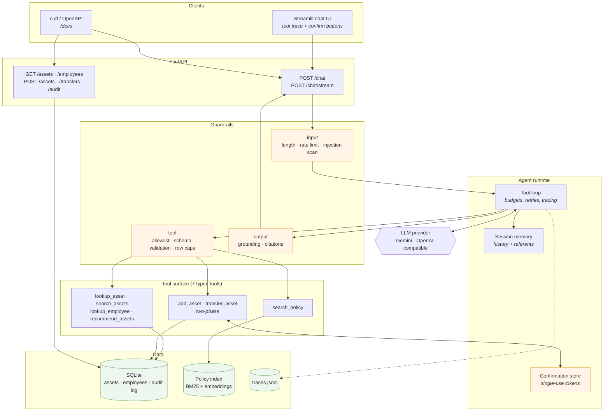
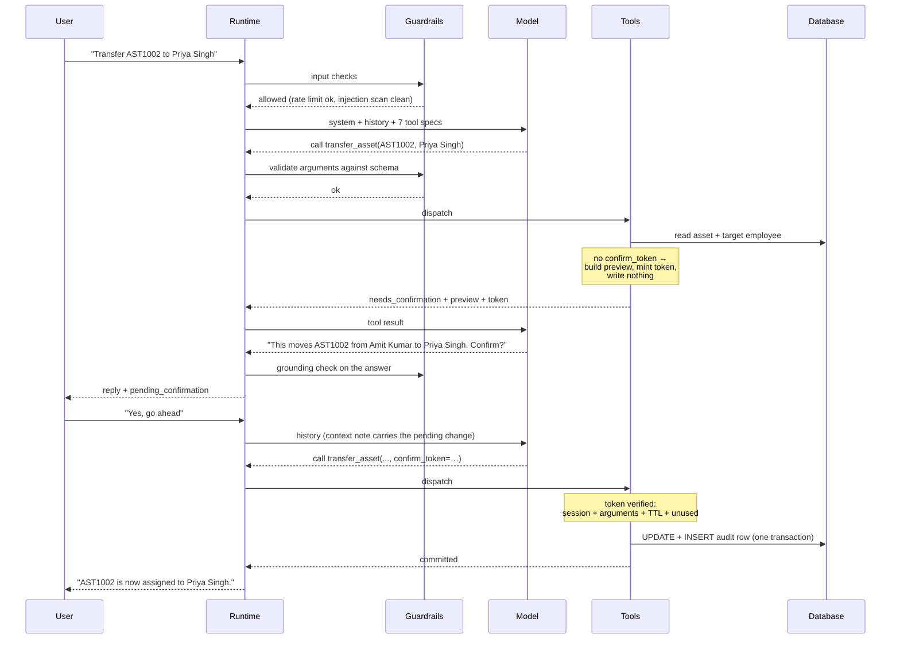

# Architecture

## System overview



## One turn, end to end



## Guardrail layers

| Layer | Control | Failure it prevents |
|---|---|---|
| Input | Length cap, per-session rate limit, control-character stripping | Prompt-stuffing; one client exhausting the shared free tier |
| Input | Injection pattern scan → flagged, turn continues with a reminder | Silent compliance with "ignore your instructions" |
| Retrieval | Passages fenced as untrusted data; system prompt says data never instructs | A policy document that tells the agent to transfer assets |
| Tool | Allowlist dispatch — unknown name returns an error result | Hallucinated tool name crashing the turn |
| Tool | Pydantic validation before the handler runs | Malformed or unbounded arguments reaching SQL |
| Tool | Enums generated from live data | Filters on categories or cities that do not exist |
| Tool | Parameterised SQL only, no text-to-SQL tool | SQL injection; unbounded table reads |
| Loop | 8 tool calls, 6 iterations, 90 s wall clock | A model looping until timeout |
| Loop | Final pass runs with tools removed | A turn ending mid-plan with no answer |
| Write | Two-phase confirmation token | Any mutation the user did not approve |
| Write | Token inert until a later user turn releases it | The model previewing and redeeming its own token in one turn |
| Write | Token bound to session + arguments + TTL, single use | Replay; approval swapped onto a different change |
| Write | Optimistic concurrency on `updated_at` | Committing against a row that moved after the preview |
| Write | Idempotency key + audit row per mutation | Double-applied retries; unattributable changes |
| Output | Asset codes cross-checked against tool results | Confidently inventing an asset that does not exist |
| Output | Citation required when policy was retrieved | Unsourced policy claims |

The write gate is the load-bearing one. Everything else reduces the chance of a
mistake; the token gate makes an unapproved write *structurally* impossible,
regardless of how convinced the model is.

Note the second row carefully, because it is the row that makes the claim true.
Binding a token to session, arguments and TTL says nothing about *who* redeemed
it, and the token is handed to the model in the tool result — so a model that
previews a change can immediately redeem its own token and report the change as
done, without the user having seen a thing. Tokens are therefore inert until
`ConfirmationStore.release_for_session` marks them redeemable, which happens
once per user turn at the top of `run_turn`. Commit requires a second user
message; the turn boundary is where the human's veto lives.

## Design decisions

**Hand-written tool loop, not an SDK auto-loop.** The confirmation gate has to
suspend a turn between two HTTP requests — preview returns to the user, the turn
ends, the commit happens later with conversation intact. An automatic loop that
runs tools to completion inside one call cannot express that. Owning the loop
also puts guardrail checks between the model deciding to act and the action
happening.

**No text-to-SQL tool.** A fixed surface of seven typed tools costs some
expressiveness and buys three things: injection stops being a live concern, tool
selection becomes measurable in evals, and every query has a bounded cost.

**Compound `lookup_asset` return.** It returns the holder *and* the holder's
manager, so the brief's multi-step question resolves in one call. Free-tier
models chain unreliably; removing an unnecessary hop is cheaper than prompting
around it.

**Ranking in code, not in the prompt.** Availability is a fact, not a judgement.
`recommend_assets` filters to `status='Available'` in SQL, so the model cannot
offer an in-repair machine however the question is phrased.

**Referents recorded from tool results, not parsed from user text.** "Who is
using it?" resolves because the runtime remembers what was actually looked up
and passes that as session context. A pronoun regex would break on the first
phrasing nobody anticipated.

**Provider behind an interface.** The runtime imports no vendor SDK. Gemini is
primary; any OpenAI-compatible endpoint is a config change. Written for a free
tier that can run out mid-demo.

**Validation in our layer, not the provider's.** Gemini honours only a subset of
OpenAPI schema and ignores `additionalProperties: false`, so arguments are
validated with Pydantic before dispatch. Stronger than trusting the provider and
portable across providers by construction.

## Repository layout

```
src/assistant/
  config.py            all tunables in one settings object
  llm/                 provider abstraction — base, gemini, openai_compat
  db/                  schema.sql, seed.py, repo.py (only module importing sqlite3)
  tools/               7 tools, schemas, registry, catalog
  rag/                 chunker, index, hybrid retriever
  agent/               runtime (the loop), prompts, memory, confirm
  guardrails/          input, injection, limits, output
  api/                 FastAPI app + models
  ui/                  Streamlit chat client
  obs/                 structured tracing
evals/                 cases.yaml, runner.py, report.md
tests/                 130 tests, no network required
docs/policies/         7 policy documents (the RAG corpus)
```
